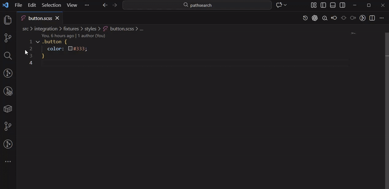
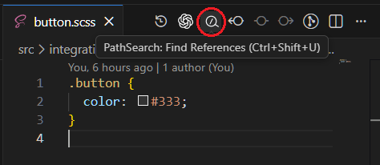

# PathSearch

English | **[日本語](README.ja.md)**

Transform file paths to search queries with customizable patterns and view results instantly in a Peek view.




**Why PathSearch?** Standard LSP-based "Find All References" works great for code symbols, but fails for file path-based references like template paths, translation keys, or dynamic imports. PathSearch bridges this gap by converting physical file paths into logical search queries automatically.

## Features

- **Pattern-based file transformation**: Define regex patterns to transform file paths into search queries
- **Inline Peek Results**: View search results in a Peek view without leaving your current file
- **Search with ripgrep**: Uses ripgrep (via PATH or VS Code bundle)
- **Respects .gitignore**: Exclusions are honored by ripgrep
- **Auto-detection**: Automatically selects the right pattern based on file type
- **Multiple patterns per file type**: Support different search strategies for the same file
- **Secure**: Protected against command injection, path traversal, and other security vulnerabilities

## ripgrep resolution

PathSearch uses ripgrep in the following order:

1. `pathsearch.ripgrepPath` (no fallback when set)
2. `rg` from PATH
3. VS Code bundled `app/node_modules/@vscode/ripgrep/bin` (path may change between VS Code versions)

If none are available, install ripgrep using the [official installation guide](https://github.com/BurntSushi/ripgrep#installation), then add it to your PATH or set `pathsearch.ripgrepPath` to the executable path.

## Usage

### 1. Configure Search Rules

Add search rules to your `.vscode/settings.json`:

```json
{
  "pathsearch.rules": [
    {
      "name": "Template File",
      "match": "**/*.{twig,blade.php,ejs,hbs}",
      "transforms": [
        {
          "extractFrom": ".*views/(.*)",
          "searchFor": "@YourNamespace/$1"
        }
      ]
    },
    {
      "name": "React Component - Import",
      "match": "**/*.tsx",
      "transforms": [
        {
          "extractFrom": ".*/components/(.*)\\.tsx$",
          "searchFor": "import.*from ['\"].*/$1['\"]",
          "searchAsRegex": true
        }
      ]
    },
    {
      "name": "SCSS Relative Imports",
      "match": "**/*.scss",
      "relative": {
        "matchTarget": "fileStem",
        "maxDepth": 3,
        "searchScope": "src/",
        "filePattern": "**/*.scss"
      }
    }
  ]
}
```

### 2. Find References

#### Inline Results (Peek)

- **Keyboard Shortcut**: `Ctrl+Shift+U` (Windows/Linux) or `Cmd+Shift+U` (Mac)
- **Command Palette**: `PathSearch: Find References`
- Shows results in an inline Peek view at your current cursor position

#### Other Commands

- **`PathSearch: Find References`**: Shows results in a Peek view (uses rule selection rules)
- **`PathSearch: Find References (Always Picker)`**: Always show the rule picker before searching

## Configuration

### `pathsearch.rules`

Array of search rules. Each rule includes the following (at least one of `transforms` or `relative` is required):

- **`name`** (required): Rule display name
- **`match`** (required): Glob pattern to match files (empty string matches nothing)
- **`matchWorkspace`** (optional): Limit this rule to specific workspace names
- **`maxResults`** (optional): Override `pathsearch.maxResults` for this rule
- **`transforms`** (optional): Array of transform definitions
- **`relative`** (optional): Relative path search settings

#### `matchWorkspace`

Limit a rule to specific workspace names:

```json
{
  "name": "Monorepo only",
  "match": "**/*.ts",
  "matchWorkspace": ["my-monorepo", "client-app"],
  "transforms": []
}
```

Glob or regex matching (by workspace name):

```json
{
  "name": "App workspaces",
  "match": "**/*.ts",
  "matchWorkspace": { "type": "glob", "values": ["*-app"] },
  "transforms": []
}
```

```json
{
  "name": "Corp workspaces",
  "match": "**/*.ts",
  "matchWorkspace": { "type": "regex", "values": ["^corp-"] },
  "transforms": []
}
```

#### `transforms` (array)

Each transform includes:

- **`extractFrom`** (required): Regular expression to match against workspace-relative file path
- **`searchFor`** (required): Replacement pattern (use `$1`, `$2` for capture groups)
- **`searchAsRegex`** (optional): Use the result as a regex pattern in ripgrep search
- **`searchScope`** (optional): Limit search to specific directories (e.g., `"src/"` or `["src/", "app/"]`)
- **`filePattern`** (optional): Limit search to matching files (e.g., `"**/*.twig"`, `"**/*.{scss,css}"` or `["**/*.twig", "**/*.html"]`)

#### `relative` (object)

Relative path search settings:

- **`matchTarget`** (required): What to match (`parentDir`, `fileName`, `fileStem`)
- **`maxDepth`** (optional): Maximum number of `../` segments allowed. Use `0` to allow only same-level (and child) relative paths.
- **`searchScope`** (optional): Limit search to specific directories (e.g., `"src/"` or `["src/", "app/"]`)
- **`filePattern`** (optional): Limit search to matching files (e.g., `"**/*.scss"`, `"**/*.{scss,css}"` or `["**/*.scss", "**/*.css"]`)

### `pathsearch.showPickerOnMultiple`

Default: `false`

Controls whether to show the picker when multiple rules match. `true` shows the picker; `false` auto-selects the first rule.

### `pathsearch.maxResults`

Default: `100`

Maximum number of search results to display in the Peek view. Range: 1-10000.

Limits the number of results to prevent performance issues with very large result sets.

### `pathsearch.ripgrepPath`

Default: `""` (empty - use ripgrep from PATH or VS Code bundle)

Custom path to the ripgrep executable. See [ripgrep resolution](#ripgrep-resolution) for how it is resolved.

Example:

- macOS/Linux: `/usr/local/bin/rg`
- Windows: `C:\\Program Files\\ripgrep\\rg.exe`

### Search Limitations

PathSearch has the following built-in limitations to ensure performance and security:

- **File size limit**: Files larger than 10MB are automatically excluded from search
- **Matches per file**: Maximum 100 matches per file
- **Total output limit**: Search terminates if ripgrep output exceeds 5MB
- **Path restrictions**: `searchScope` only accepts relative paths (no `..` or absolute paths, including `/`)

## Examples

### Template Files (Twig/Blade/EJS)

```json
{
  "name": "Template File",
  "match": "**/*.{twig,blade.php,ejs,hbs}",
  "transforms": [
    {
      "extractFrom": ".*views/(.*)",
      "searchFor": "@YourNamespace/$1"
    }
  ]
}
```

**File**: `src/views/book/detail.twig`
**Search query**: `@YourNamespace/book/detail.twig`

> **Note**: Replace `@YourNamespace` with your project's actual namespace (e.g., `@BookwalkerMain`, `@App`, `@Templates`).

### React/TypeScript Components

```json
{
  "name": "React Component",
  "match": "**/{components,hooks}/**/*.{tsx,ts}",
  "transforms": [
    {
      "extractFrom": ".*/(?:components|hooks)/(.*)\\.tsx?$",
      "searchFor": "from ['\"].*/$1",
      "searchAsRegex": true
    }
  ]
}
```

**File**: `src/components/Button/Button.tsx`
**Search query (regex)**: `from ['"].*Button/Button`

### Python Modules

```json
{
  "name": "Python Module",
  "match": "**/*.py",
  "transforms": [
    {
      "extractFrom": ".*/([^/]+)/([^/]+)\\.py$",
      "searchFor": "from $1.$2 import|from $1 import $2",
      "searchAsRegex": true
    }
  ]
}
```

**File**: `myapp/models/user.py`
**Search query (regex)**: `from models.user import|from models import user`

### i18n Translation Keys

```json
{
  "name": "Translation Key",
  "match": "**/{locales,i18n,translations}/**/*.{json,yaml,yml}",
  "transforms": [
    {
      "extractFrom": ".*/([^/]+)/([^/]+)\\.(json|yaml|yml)$",
      "searchFor": "$1:$2\\.|['\"]$1:$2\\.",
      "searchAsRegex": true
    }
  ]
}
```

**File**: `locales/en/common.json`
**Search query (regex)**: `en:common\.|['"]en:common\.`
**Finds**: `t('en:common.welcome')`, `i18n.t("en:common.button")`

### Relative Imports (SCSS)

```json
{
  "name": "SCSS Relative Imports",
  "match": "**/*.scss",
  "relative": {
    "matchTarget": "fileStem",
    "maxDepth": 3,
    "searchScope": "src/",
    "filePattern": "**/*.scss"
  }
}
```

**File**: `src/styles/button.scss`
**Search**: Finds relative imports like `@use "./button"` or `@import "../styles/button"`

### Limiting Search Scope

Limit search to specific directories for faster results:

```json
{
  "name": "Frontend Component",
  "match": "**/*.tsx",
  "transforms": [
    {
      "extractFrom": ".*/components/(.*)\\.tsx$",
      "searchFor": "import.*from ['\"].*/$1['\"]",
      "searchAsRegex": true,
      "searchScope": "src/frontend/" // Only search in frontend directory
    }
  ]
}
```

**Benefits**:

- Faster search (fewer files to scan)
- More relevant results (excludes backend code)
- Better organization for monorepos

**Multiple directories**:

```json
{
  "searchScope": ["src/", "app/", "lib/"]
}
```

Note: `searchScope` does not support wildcards. Use `filePattern` to filter files instead.

**File pattern filter**:

```json
{
  "filePattern": "**/*.twig"
}
```

This limits searches to matching files while keeping the same scope.

### Configuration Example

Complete configuration example with all options:

```json
{
  "pathsearch.rules": [
    {
      "name": "React Component",
      "match": "**/*.tsx",
      "transforms": [
        {
          "extractFrom": ".*/components/(.*)\\.tsx$",
          "searchFor": "import.*from ['\"].*/$1['\"]",
          "searchAsRegex": true,
          "searchScope": "src/" // Search only in src/ directory
        }
      ]
    },
    {
      "name": "Backend API",
      "match": "**/*.ts",
      "transforms": [
        {
          "extractFrom": ".*/api/(.*)\\.ts$",
          "searchFor": "...",
          "searchScope": ["src/backend/", "src/api/"] // Multiple directories
        }
      ]
    }
  ],
  "pathsearch.showPickerOnMultiple": false,
  "pathsearch.maxResults": 100,
  "pathsearch.ripgrepPath": ""
}
```

## Advanced Usage

### Peek Workflow

Peek results are perfect for quickly checking where a file is used without losing your place:

1. Open any file in your project
2. Press `Cmd+Shift+U` (Mac) or `Ctrl+Shift+U` (Windows/Linux)
3. Results appear inline at your cursor position
4. Navigate through results with arrow keys
5. Press `Escape` to close and return to your code

## Security

PathSearch is designed with security in mind:

### Protected Against

- **Command injection**: Uses secure `spawn` API instead of shell execution
- **Path traversal**: Validates all file paths to prevent access outside workspace
- **Resource exhaustion**: Limits output size and result count
- **Information disclosure**: Sanitizes error messages shown to users

### Security Features

- No arbitrary code execution
- Input validation on all user-provided patterns
- Workspace boundary enforcement
- Secure handling of external commands

All search rules can be defined in either workspace or user settings, giving you full control and visibility.

## License

WTFPL (Do What The Fuck You Want To Public License)

Copyright (C) 2026 horyu

See [LICENSE](LICENSE) file for details.
